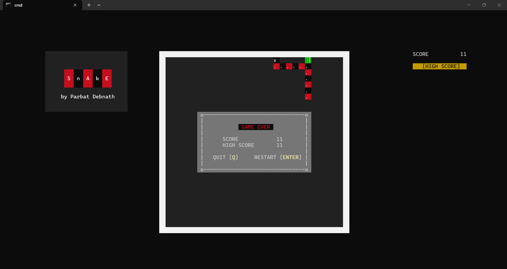

# Terminal based classic Snake game in C
### Classic terminal-based C game developed in C with persistent storage, smooth rendering and retro-console experience.
---

## Features
- Persistent Storage
- Arrow key movement
- Partial rendering for smooth experience
- Colored terminal rendering

## Screenshots

## How to use ?

1. Download the zip file from release
2. Unzip the zip file
3. Navigate to the build.bat file
4. Double click and start playing!

## Author

**Parbat Debnath**
GitHub : [https://github.com/parbat-debnath](https://github.com/parbat-debnath)